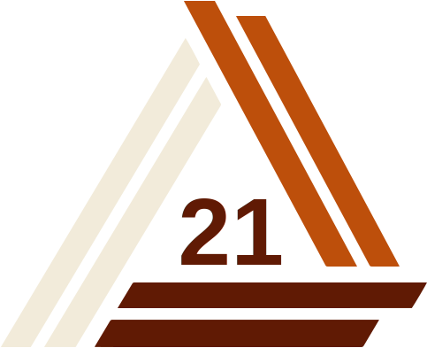
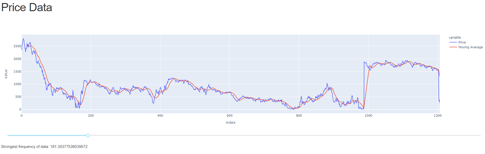
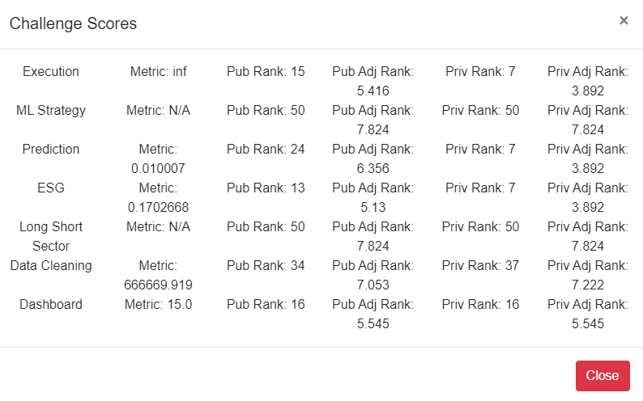

# Algothon 2021

## Data Cleaning

To clean the dataset, pandas was used to identify NaN values and local outliers, and remove them. There was potential for further data cleaning using central tendency, a rolling median, and filling in outliers/NaN values instead of outright removing them.

## Prediction

A regression classifier was used to predict the Log-Returns value of provided stocks. Deep layers were used in the Sequential classifier to reduce the input tensor from 177 features to 1 label. Accuracy was found to be poor in this configuration due to the large number of input features. A possible improvement would be the Scikit-learn Feature Selector to cut down the number of input features, thereby improving the quality of the input feature.

## Data Visualisation

The data visualisation task involved showcasing the dataset from the Data Cleaning Challenge. A simple graph was built using Dash Plotly in python, with a simple interactive slider to calculate market momentum using a simple moving average. The demo is available [here](https://plotly-algo.herokuapp.com/).

## Low Latency Challenge

Data is ingested from command line in a CSV format, and sent to the `stdin` of the cpp file. Run the file using `time cat train/train_50_0.csv | make run > predictions.csv`. The prediction will be output as a zero or one in predictions.csv

The provided training set was a 1826 long time-series data of logreturns, which was split into sets of 500 for training purposes.

The algorithm was tested with the dataset provided. After further analysis, it was recognised that the algorithm was not producing consistent results of >50% accuracy. To optimise for speed, a barebones script was used as a Constant Guesser.

The program was written in C++ to minimise latency, with an emphasis on runtime speed and minimal focus on accuracy. The code was tested on a RPI 4 4GB, with a compile time of 11s and a runtime of 9ms (mostly due to the `cat` write calls).

## Final Results

Despite starting this as a casual learning experience in my first solo hackathon, I managed to place 18th out of 40 teams.

